<h2>TensorFlow-FlexUNet-Image-Segmentation-Aerial-Imagery-Road (2025/11/11)</h2>

Toshiyuki Arai 
Software Laboratory antillia.com 
 
This is the first experiment of Image Segmentation for <b>Aerial Imagery Road</b> (Singleclass)  based on 
our <a href="./src/TensorFlowFlexUNet.py">TensorFlowFlexUNet</a>
 (<b>TensorFlow Flexible UNet Image Segmentation Model for Multiclass</b>)
, and a 572x572  pixels 
<a href="https://drive.google.com/file/d/1Ju3Fk5Jxgtzc-jnLMWNimEksJxD1Z8JQ/view?usp=sharing">
<b>Augmented-Road-ImageMask-Dataset.zip</b></a>
which was derived by us from 
<a href="https://gisstar.gsi.go.jp/gsi-dataset/02/H1-No17-572.zip">H1-No17-572.zip
</a> in Japanese web site <a href="https://gisstar.gsi.go.jp/gsi-dataset/02/index.html">GSI Dataset-02 (Roads)</a>
  
As demonstrated in <a href="https://github.com/sarah-antillia/TensorFlow-FlexUNet-Image-Segmentation-STARE-Retinal-Vessel">
TensorFlow-FlexUNet-Image-Segmentation-STARE-Retinal-Vessel</a>, 
our Multiclass TensorFlowFlexUNet, which uses categorized masks, can also be applied to single-class image segmentation models. 
This is because it inherently treats the background as one category and your single-class mask data as a second category. 
In essence, your single-class segmentation model will operate with two categorized classes within our Multiclass UNet framework.
  
<b>Data Augmentation Strategy</b> 
To address the limited size of <b>GSI Dataset-02 (Roads)</b>, which contains 2,000 images and overlay-masks respectively,
we used our offline augmentation tool <a href="https://github.com/sarah-antillia/ImageMask-Dataset-Offline-Augmentation-Tool"> 
ImageMask-Dataset-Offline-Augmentation-Tool</a> to augment the original dataset.
  

<b>Actual Image Segmentation for Images of 572x572 pixels</b> 
As shown below, the inferred masks predicted by our segmentation model trained on the 
Augmented dataset appear similar to the ground truth masks, but they lack precision in certain areas. 
 
<table>
<tr>
<th>Input: image</th>
<th>Mask (ground_truth)</th>
<th>Prediction: inferred_mask</th>
</tr>
<tr>
<td>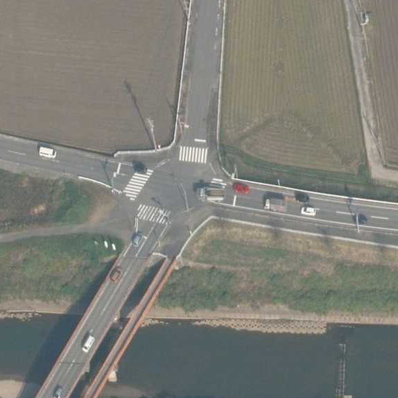</td>
<td>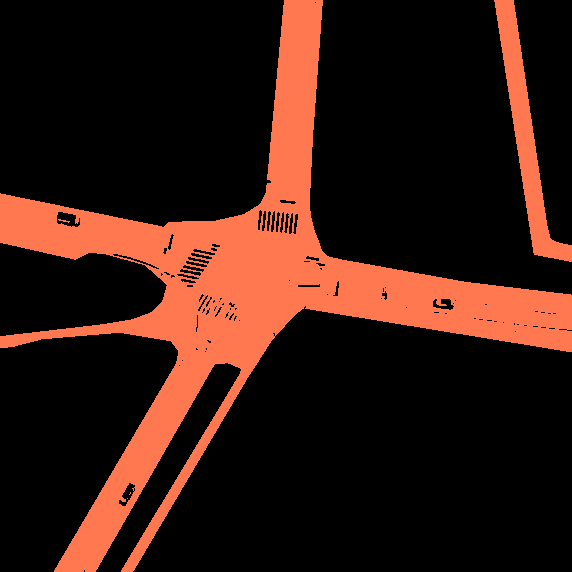</td>
<td>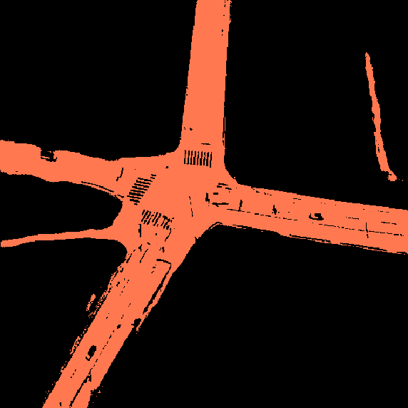</td>
</tr>
</tr>
<td>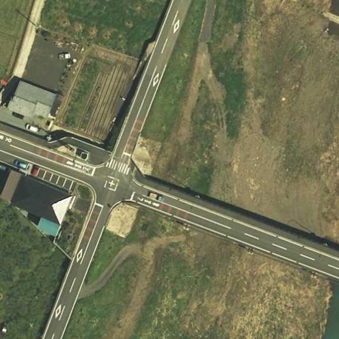</td>
<td>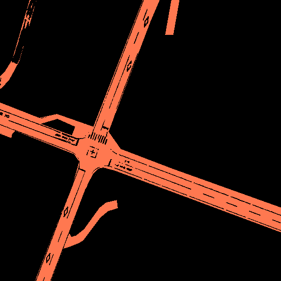</td>
<td>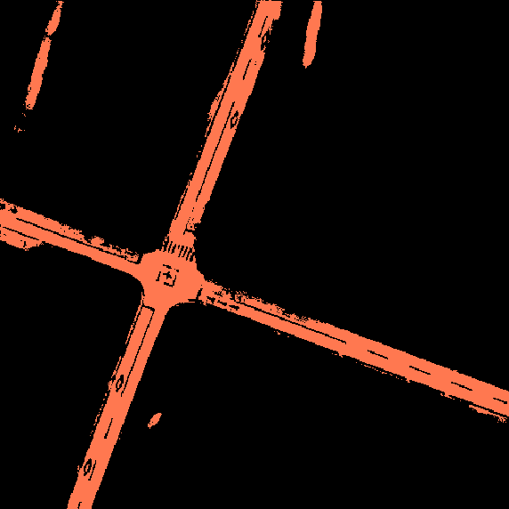</td>
</tr>
<tr>
<td>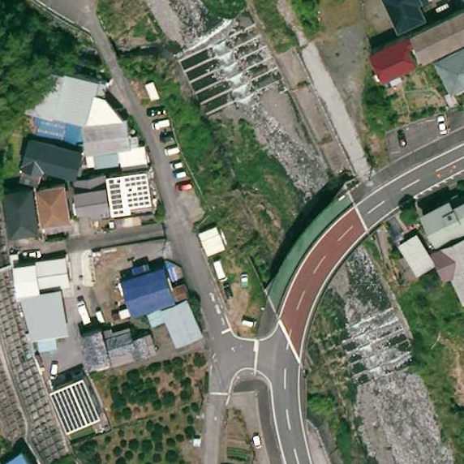</td>
<td>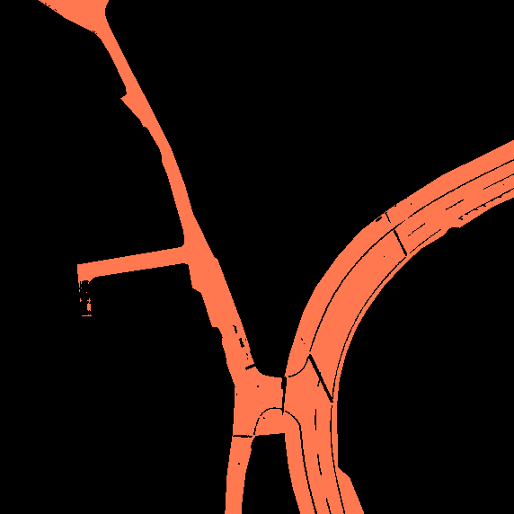</td>
<td>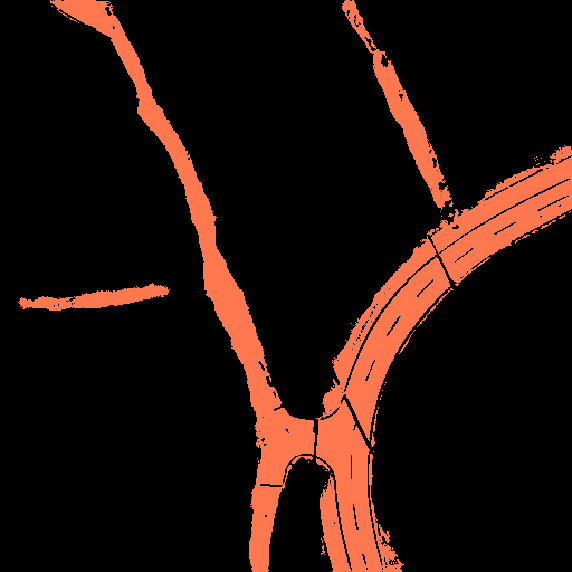</td>
</tr>
</table>

 
<h3>
1 Dataset Citation
</h3>
The dataset used here was derived from 
<a href="https://gisstar.gsi.go.jp/gsi-dataset/02/H1-No17-572.zip">
H1-No17-572.zip
</a>
in Japanese web site <a href="https://gisstar.gsi.go.jp/gsi-dataset/02/index.html">
GSI Dataset-02 (Roads)
</a> 
  
Please see also English page
<a href="https://www.gsi.go.jp/ENGLISH/index.html">
GSI: Geospatial Information Authority of Japan
</a>
 
 
<b>GSI Dataset-02 (Roads)</b> 
<b>Overview</b> 
This data is intended for use in machine learning, and is an 8-bit, 3-channel image of an aerial photograph taken with a 
ground pixel size of 20 cm, with pixels that show roads labeled in red (RGB:#FF0000).  
For use in machine learning, each piece of data consists of two pairs: the original image and the labeled image, 
and each pair can be identified by its file name.
  
<b>Image specifications</b> 
Image sizes are available in two sizes: 572 x 572 pixels and 286 x 286 pixels. 
Both images have a bit depth of 8 bits per channel and are in PNG format. 
As of November 10, 2022, there are 2,000 pairs of 572 x 572 pixel images and 10,000 pairs of 286 x 286 pixel images available for download.
 
 
<b>Source</b> 
 This data can be used under <a href="https://www.gsi.go.jp/ENGLISH/page_e30286.html">
 Geospatial Information Authority of Japan (GSI) Website Terms of Use</a>.  
 If you use it in a research presentation, etc., please indicate the source as follows: 
<b>
Geospatial Information Authority of Japan (2022):  
Training image data for road extraction using CNN, Geospatial Information Authority of Japan Technical Paper H1-No.17.
</b>
 
 
<b>License</b> 
<a href="https://www.digital.go.jp/en/resources/open_data/public_data_license_v1.0">
Public Data License (Version 1.0)
</a>
 
 
<h3>
2 Road ImageMask Dataset
</h3>
<h4>2.1 Augmented ImageMask Dataset</h4>
 If you would like to train this Road Segmentation model by yourself,
 please download <a href="https://drive.google.com/file/d/1Ju3Fk5Jxgtzc-jnLMWNimEksJxD1Z8JQ/view?usp=sharing">
 <b>Augmented-Road-ImageMask-Dataset.zip </b></a>
on the google drive, expand the downloaded, and put it under dataset folder to be:
<pre>
./dataset
└─Road
    ├─test
    │  ├─images
    │  └─masks
    ├─train
    │  ├─images
    │  └─masks
    └─valid
        ├─images
        └─masks
</pre>
<b>Road Statistics</b> 
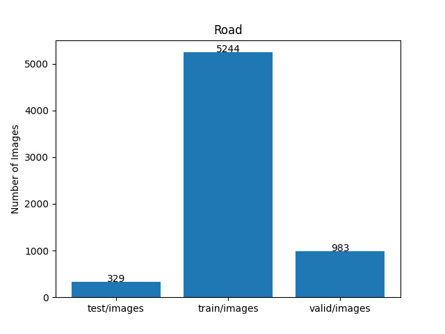 
 

As shown above, the number of images of train and valid datasets is large enough to use for a training set of our segmentation model.
  
<h4>2.2 Derivation colorized masks</h4>
The folder structure of the original H1-No17-572 dataset is the following. 
<pre>
 ./H1-No17-572    
  ├─org  (raw images)
  │  ├─1.png
    ...
  │  └─2000.png
  └─val  (mask overlay)
      ├─1.png
    ... 
      └─2000.png
</pre>
In our dataset, we generated each colorized mask from a pair of raw image and mask overy (mask-overlapped-image),
 by subtracting the raw image from the corresponding mask overlay, and colorizing the subtracted image with light-brown.  
As shown below, the generated colorized masks are slightly different from the original solid red mask in mask overlay. 
<table>
<tr>
<th>mask overlay</th><th>raw image</th><th>colorized masks</th>
</tr>
<tr>

<td>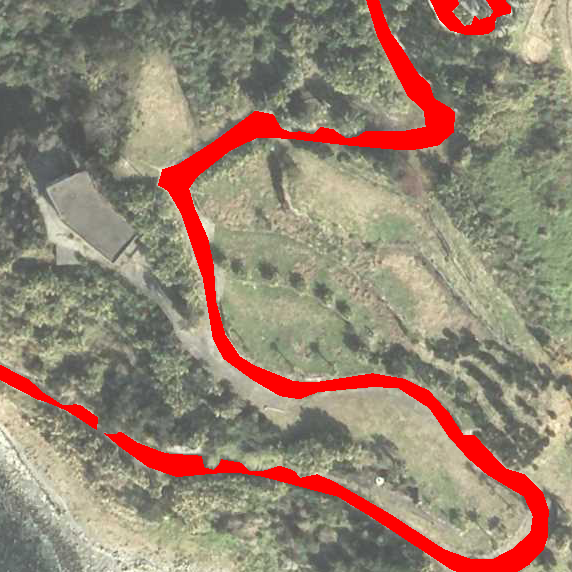</td>
<td>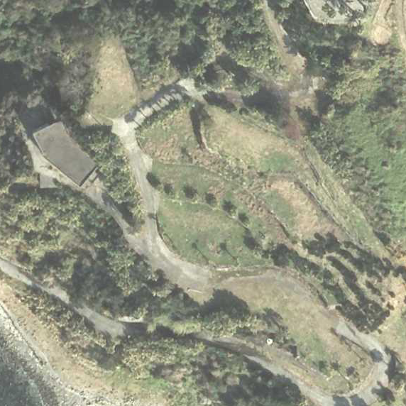</td>
<td>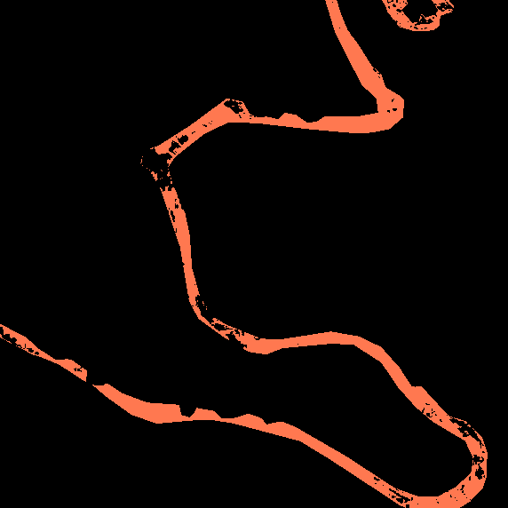</td>
</tr>
<tr>
<td>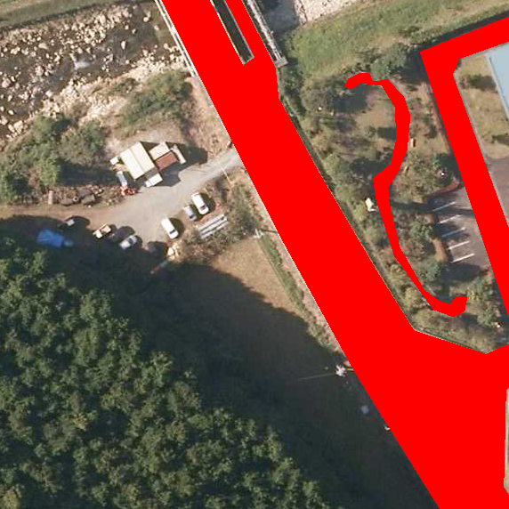</td>
<td>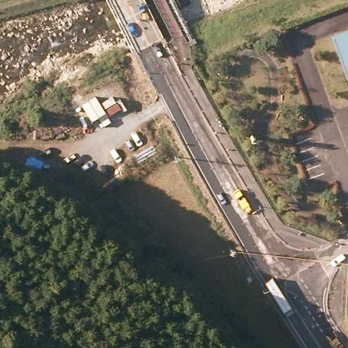</td>
<td></td>
</tr>
<tr>
<td>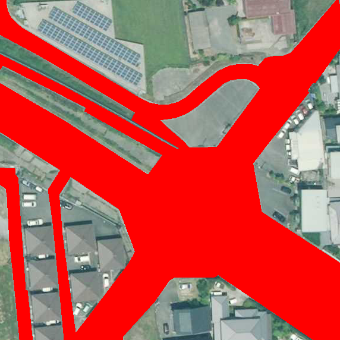</td>
<td>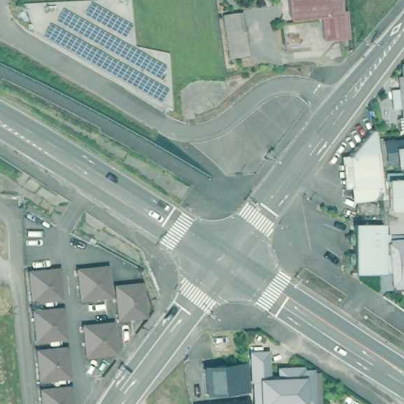</td>
<td>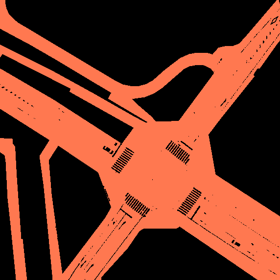</td>
</tr>

</table>

  
<h4>2.3 Train images and masks sample</h4>

<b>Train_images_sample</b> 
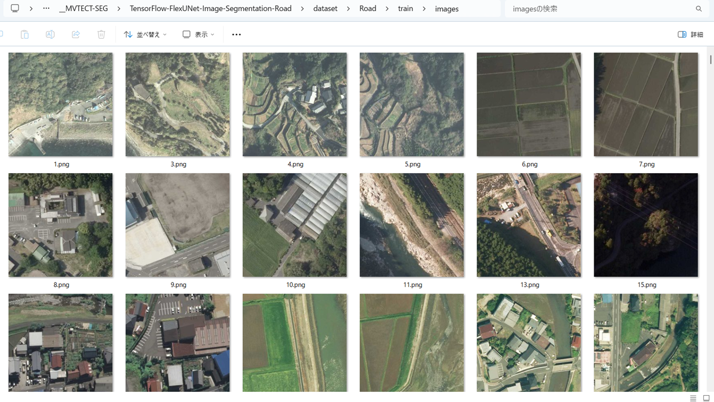
 
<b>Train_masks_sample</b> 
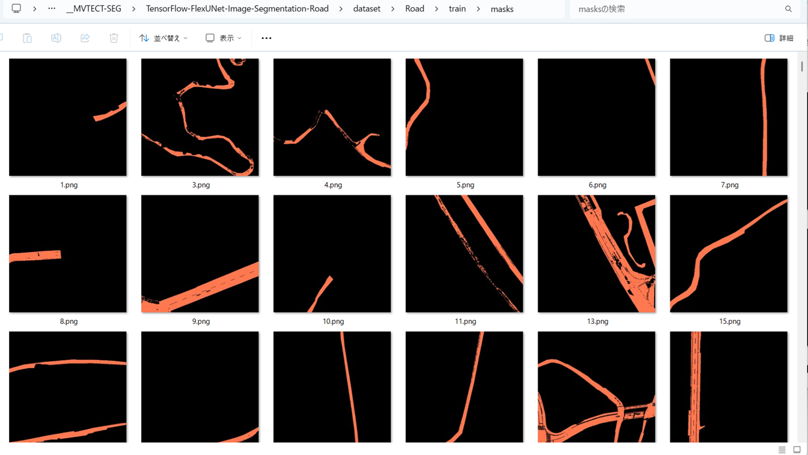
 
 
<h3>
3 Train TensorFlowUNet Model
</h3>
 We trained Road TensorFlowFlexUNet Model by using the following
<a href="./projects/TensorFlowFlexUNet/Road/train_eval_infer.config"> <b>train_eval_infer.config</b></a> file.  
Please move to ./projects/TensorFlowFlexUNet/Road and, and run the following bat file. 
<pre>
>1.train.bat
</pre>
, which simply runs the following command. 
<pre>
>python ../../../src/TensorFlowFlexUNetTrainer.py ./train_eval_infer.config
</pre>

<b>Model parameters</b> 
Defined a small <b>base_filters = 16</b> and large <b>base_kernels = (9,9)</b> for the first Conv Layer of Encoder Block of 
<a href="./src/TensorFlowFlexUNet.py">TensorFlowFlexUNet.py</a> 
and a large num_layers (including a bridge between Encoder and Decoder Blocks).
<pre>
[model]
image_width    = 512
image_height   = 512
image_channels = 3

num_classes    = 2

base_filters   = 16
base_kernels   = (9,9)
num_layers     = 8
dropout_rate   = 0.05
dilation       = (1,1)

</pre>

<b>Learning rate</b> 
Defined a very small learning rate.  
<pre>
[model]
learning_rate  = 0.00007
</pre>

<b>Online augmentation</b> 
Disabled our online augmentation.  
<pre>
[model]
model         = "TensorFlowFlexUNet"
generator     = False
</pre>

<b>Loss and metrics functions</b> 
Specified "categorical_crossentropy" and <a href="./src/dice_coef_multiclass.py">"dice_coef_multiclass"</a>. 
You may specify other loss and metrics function names. 
<pre>
[model]
loss           = "categorical_crossentropy"
metrics        = ["dice_coef_multiclass"]
</pre>
<b>Learning rate reducer callback</b> 
Enabled learing_rate_reducer callback, and a small reducer_patience.
<pre> 
[train]
learning_rate_reducer = True
reducer_factor     = 0.5
reducer_patience   = 4
</pre>

<b>Early stopping callback</b> 
Enabled early stopping callback with patience parameter.
<pre>
[train]
patience      = 10
</pre>

<b>RGB Color map</b> 
rgb color map dict for Road 1+1 classes.
<pre>
[mask]
mask_datatype    = "categorized"
mask_file_format = ".png"
; road : BGR (80, 120, 255)
;                    road:light brown
rgb_map = {(0,0,0):0,(255,120,80):1, }
</pre>

<b>Epoch change inference callback</b> 
Enabled <a href="./src/EpochChangeInferencer.py">epoch_change_infer callback (EpochChangeInferencer.py)</a></b>. 
<pre>
[train]
epoch_change_infer       = True
epoch_change_infer_dir   =  "./epoch_change_infer"
num_infer_images         = 6
</pre>

By using this callback, on every epoch_change, the inference procedure can be called
 for 6 images in <b>mini_test</b> folder. This will help you confirm how the predicted mask changes 
 at each epoch during your training process.    

<b>Epoch_change_inference output at starting (epoch 1,2,3)</b> 
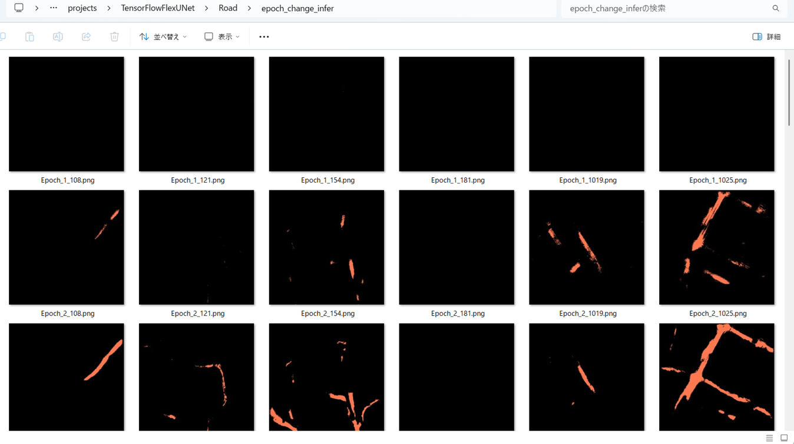 
 
<b>Epoch_change_inference output at middlepoint (epoch 15,16,17)</b> 
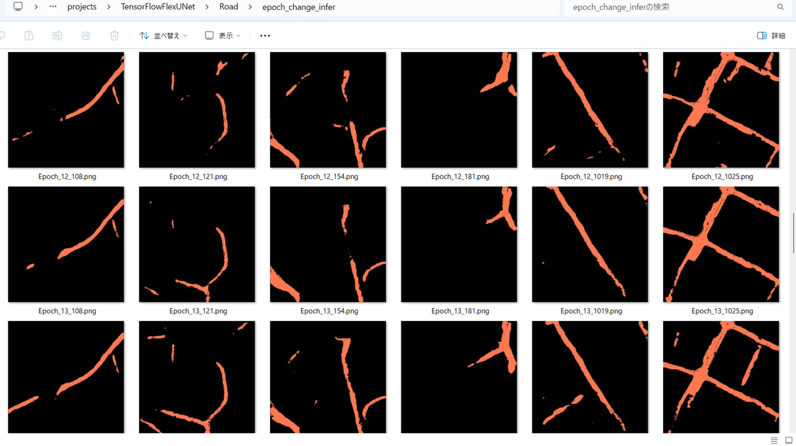 
 

<b>Epoch_change_inference output at ending (epoch 31,32,33)</b> 
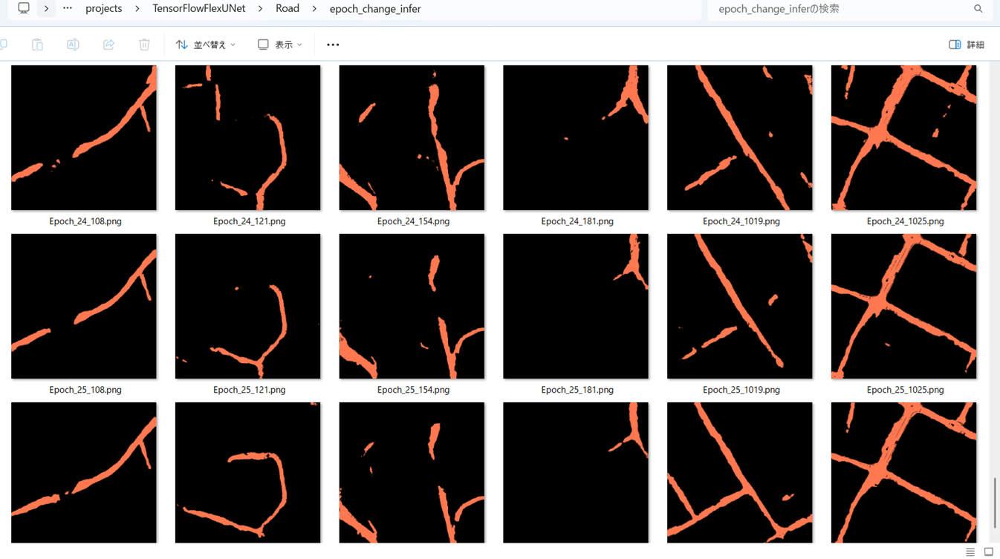 
 

In this experiment, the training process was terminated at epoch 33.  
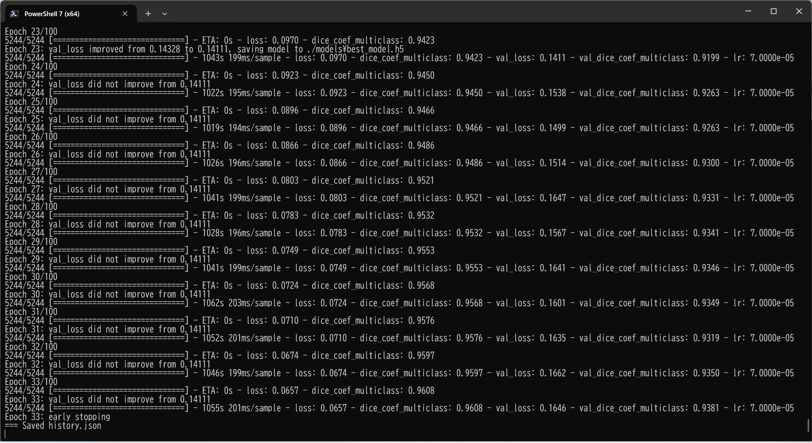 
 

<a href="./projects/TensorFlowFlexUNet/Road/eval/train_metrics.csv">train_metrics.csv</a> 
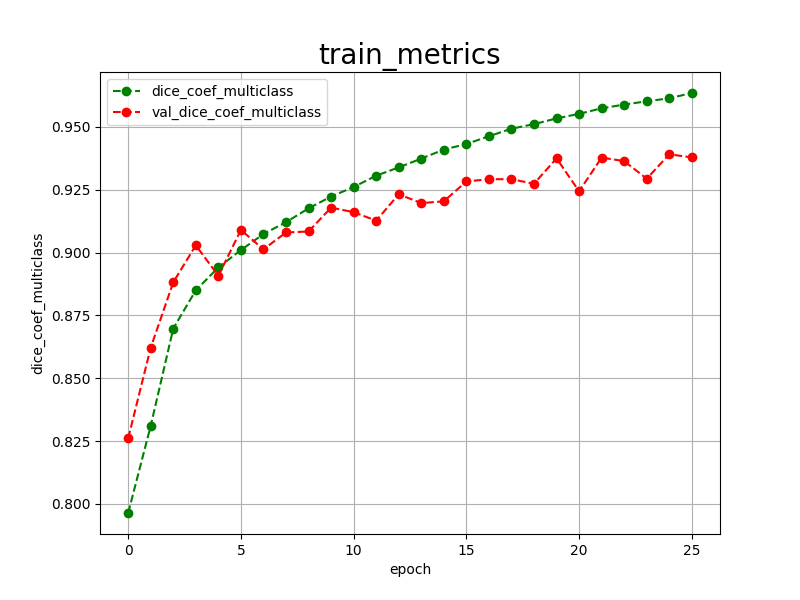 

 
<a href="./projects/TensorFlowFlexUNet/Road/eval/train_losses.csv">train_losses.csv</a> 
 

 

<h3>
4 Evaluation
</h3>
Please move to a <b>./projects/TensorFlowFlexUNet/Road</b> folder, 
and run the following bat file to evaluate TensorFlowUNet model for Road. 
<pre>
./2.evaluate.bat
</pre>
This bat file simply runs the following command.
<pre>
python ../../../src/TensorFlowFlexUNetEvaluator.py ./train_eval_infer.config
</pre>

Evaluation console output: 
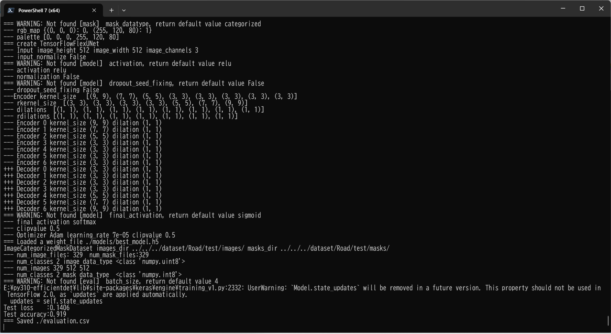
  Image-Segmentation-Road

<a href="./projects/TensorFlowFlexUNet/Road/evaluation.csv">evaluation.csv</a> 

The loss (categorical_crossentropy) to this Road/test was not low, anot dice_coef_multiclass not high as shown below.
 
<pre>
categorical_crossentropy,0.1406
dice_coef_multiclass,0.919
</pre>
 
<h3>
5 Inference
</h3>
Please move to a <b>./projects/TensorFlowFlexUNet/Road</b> folder 
,and run the following bat file to infer segmentation regions for images by the Trained-TensorFlowFlexUNet model for Road. 
<pre>
./3.infer.bat
</pre>
This simply runs the following command.
<pre>
python ../../../src/TensorFlowFlexUNetInferencer.py ./train_eval_infer.config
</pre>

<b>mini_test_images</b> 
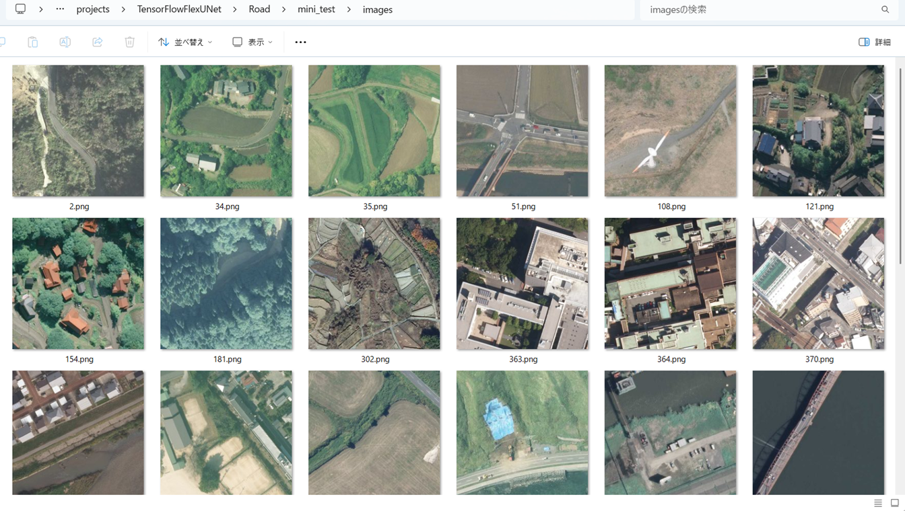 
<b>mini_test_mask(ground_truth)</b> 
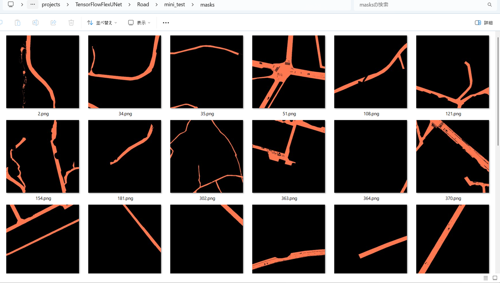 

<b>Inferred test masks</b> 
 
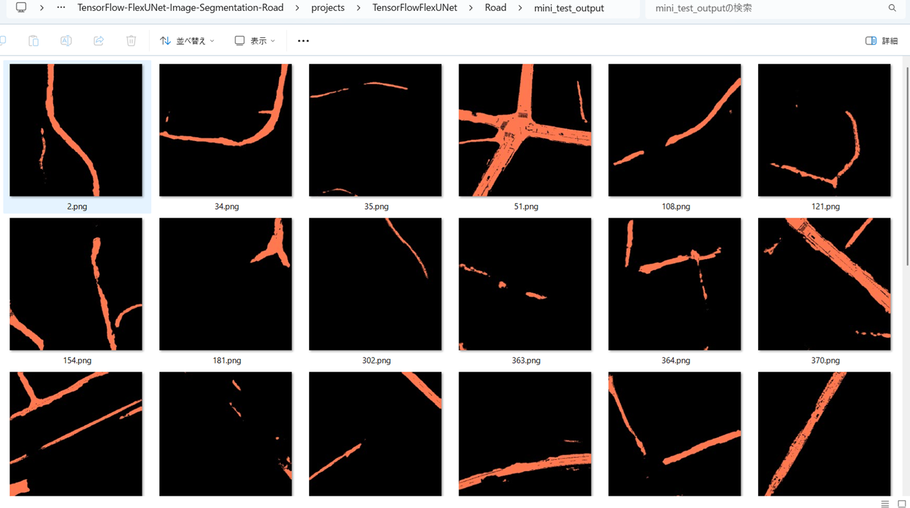 
 

<b>Enlarged images and masks for Images of 572x572 pixels </b> 

<table>
<tr>

<th>Image</th>
<th>Mask (ground_truth)</th>
<th>Inferred-mask</th>
</tr>

<td>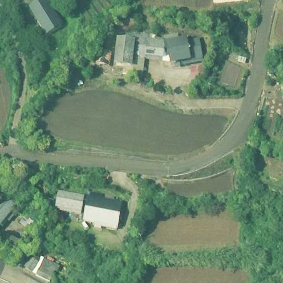</td>
<td></td>
<td></td>
</tr>
<tr>
<td>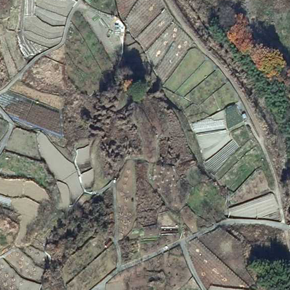</td>
<td>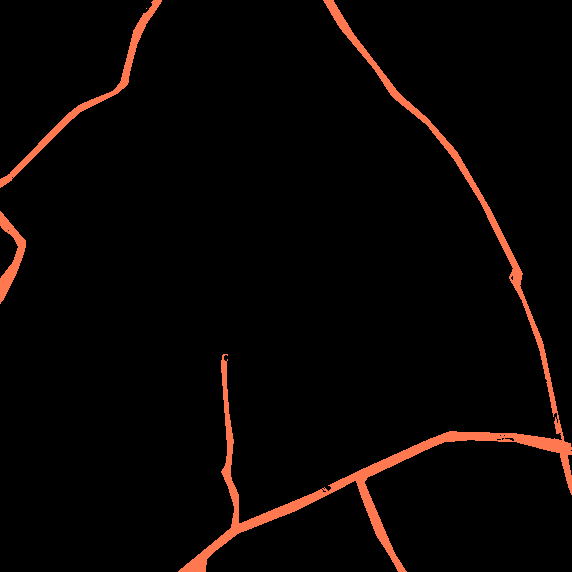</td>
<td></td>
</tr>
<tr>
<td>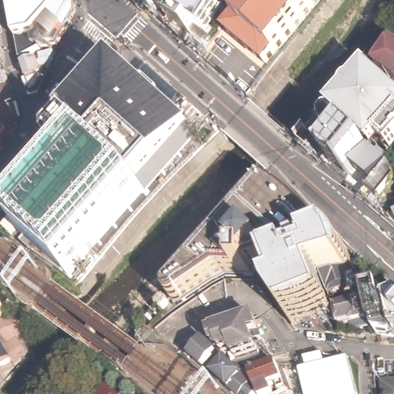</td>
<td></td>
<td></td>
</tr>

<tr>
<td>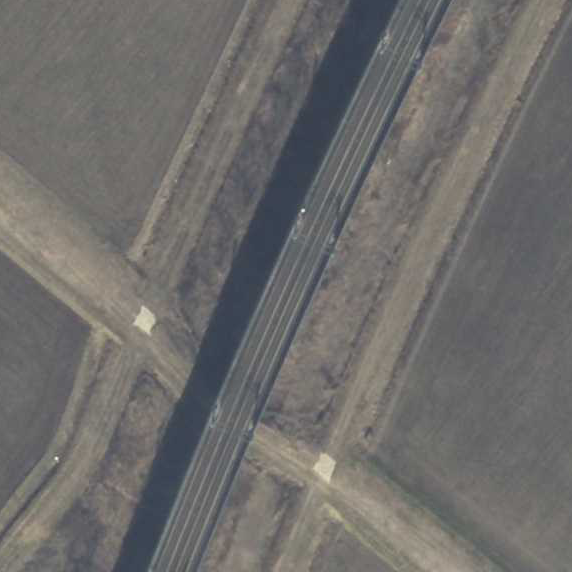</td>
<td></td>
<td></td>
</tr>
<tr>
<td>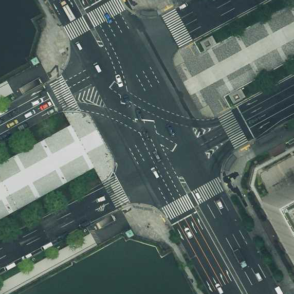</td>
<td>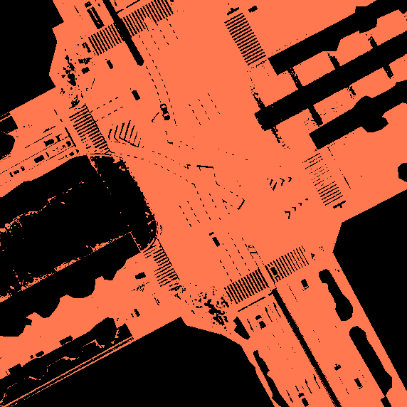</td>
<td>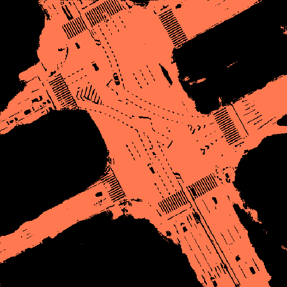</td>
</tr>
<tr>
<td>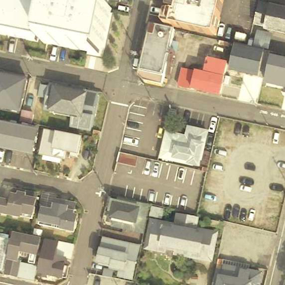</td>
<td></td>
<td></td>
</tr>

</table>

 

<h3>
References
</h3>

<b>1. TensorFlow-FlexUNet-Image-Segmentation-Model</b> 
Toshiyuki Arai antillia.com  
<a href="https://github.com/sarah-antillia/TensorFlow-FlexUNet-Image-Segmentation-Model">
https://github.com/sarah-antillia/TensorFlow-FlexUNet-Image-Segmentation-Model
</a>
 
 
<b>2. Satellite Imagery Road Segmentation</b> 
Nithish 
<a href="https://medium.com/@nithishmailme/satellite-imagery-road-segmentation-ad2964dc3812">
https://medium.com/@nithishmailme/satellite-imagery-road-segmentation-ad2964dc3812
</a>
 
 
<b>3. Deep Learning-based Road Segmentation Using Aerial Images: A Comparative Study</b> 
Kamal KC, Alaka Acharya, Kushal Devkota, Kalyan Singh Karki, and Surendra Shrestha 
<a href="https://www.researchgate.net/publication/382973365_Deep_Learning-based_Road_Segmentation_Using_Aerial_Images_A_Comparative_Study">
https://www.researchgate.net/publication/382973365_Deep_Learning-based_Road_Segmentation_Using_Aerial_Images_A_Comparative_Study</a>
 
 
<b>4. A Comparative Study of Deep Learning Methods for Automated Road Network 
Extraction from High-Spatial-ResolutionRemotely Sensed Imagery</b> 
Haochen Zhou, Hongjie He, Linlin Xu, Lingfei Ma, Dedong Zhang, Nan Chen, Michael A. Chapman, and Jonathan Li 
<a href="https://uwaterloo.ca/geospatial-intelligence/sites/default/files/uploads/documents/march2025_zhou_10.14358_pers_24-00100r2.pdf">
https://uwaterloo.ca/geospatial-intelligence/sites/default/files/uploads/documents/march2025_zhou_10.14358_pers_24-00100r2.pdf
</a>
 
 

